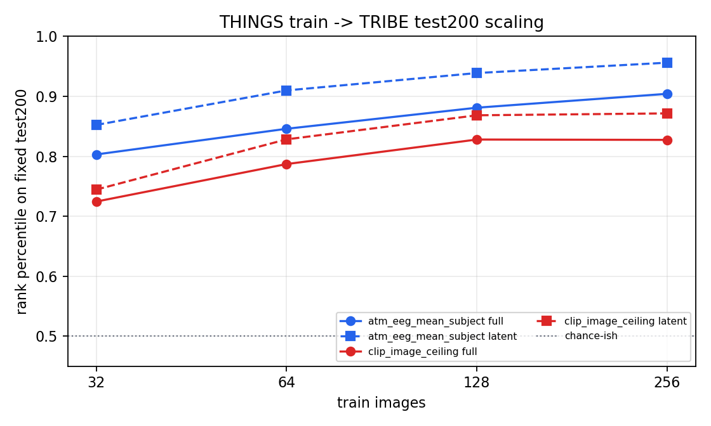

# ATM to TRIBE Train-Size Scaling

Train targets: `fmri_foundation_workspace/results/eeg_image_bridge/tribe_targets/tribe_targets_train_seed33_n256.npz`
Test targets: `fmri_foundation_workspace/results/eeg_image_bridge/tribe_targets/tribe_targets_n200.npz`
Components: `32`; alpha: `100.0`
Latent basis: PCA fit once on all extracted train targets, then reused for every train size.

| model | train images | full rank pct | shifted | full gap | latent rank pct | shifted | latent gap |
|---|---:|---:|---:|---:|---:|---:|---:|
| atm_eeg_mean_subject | 32 | 0.8030 | 0.4643 | 0.3387 | 0.8523 | 0.4745 | 0.3777 |
| clip_image_ceiling | 32 | 0.7245 | 0.4963 | 0.2281 | 0.7444 | 0.4990 | 0.2454 |
| atm_eeg_mean_subject | 64 | 0.8459 | 0.4677 | 0.3782 | 0.9098 | 0.4704 | 0.4395 |
| clip_image_ceiling | 64 | 0.7870 | 0.4938 | 0.2932 | 0.8282 | 0.4896 | 0.3386 |
| atm_eeg_mean_subject | 128 | 0.8810 | 0.4683 | 0.4127 | 0.9388 | 0.4735 | 0.4653 |
| clip_image_ceiling | 128 | 0.8279 | 0.4880 | 0.3399 | 0.8683 | 0.4911 | 0.3772 |
| atm_eeg_mean_subject | 256 | 0.9042 | 0.4760 | 0.4282 | 0.9561 | 0.4821 | 0.4740 |
| clip_image_ceiling | 256 | 0.8273 | 0.5103 | 0.3170 | 0.8715 | 0.5123 | 0.3592 |

## Readout

- This experiment predicts both the full cortical target (`20484` fsaverage5
  vertices) and a fixed `32`-D low-rank cortical latent.
- The low-rank basis is fit once on all `256` extracted THINGS train targets
  and reused for every train-size condition, so the scaling curve is measured
  in one shared latent space.
- ATM EEG mean-subject performance improves as train images increase:
  full-cortex rank percentile `0.8030 -> 0.9042`, latent rank percentile
  `0.8523 -> 0.9561`.
- Shifted-null stays near chance, around `0.46-0.48`, so the gain is not
  explained by the marginal TRIBE target distribution alone.
- This supports a post-hoc TRIBE alignment route, but it is still based on
  already-trained ATM embeddings rather than raw EEG end-to-end training.
